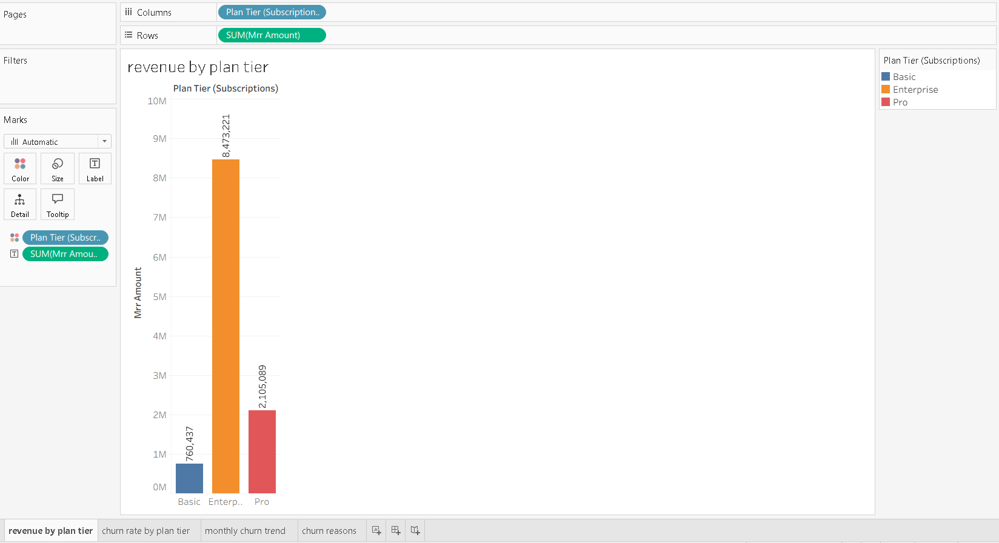
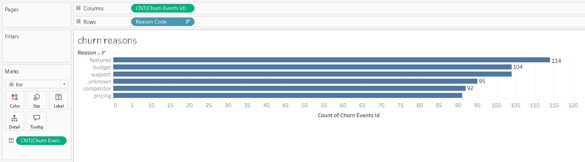

# saas-retention-revenue
# SaaS Customer Retention & Revenue Analytics

## Project Overview
This project analyzes a SaaS subscription business using SQL to understand recurring revenue, customer churn, and retention patterns.

The analysis focuses on three core business questions:

1. Where does recurring revenue come from?
2. Which customer segments have the highest churn?
3. What factors are associated with customer churn?

## Dataset
The project uses a synthetic SaaS subscription dataset from Kaggle.

Main tables:

- `accounts`
- `subscriptions`
- `churn_events`
- `feature_usage`
- `support_tickets`

The data was imported into PostgreSQL and modeled as a relational database.

## Tools Used
- PostgreSQL
- Valentina Studio
- Tableau
- SQL
- GitHub

## Database Design
The database was built around customer accounts and subscription activity.

Key relationships:

- `accounts.account_id` connects to `subscriptions`, `churn_events`, and `support_tickets`
- `subscriptions.subscription_id` connects to `feature_usage`

ID fields were stored as `TEXT` because the dataset contains alphanumeric IDs. Revenue fields were stored as `NUMERIC(10,2)`.

## SQL Analysis
The project includes three main SQL analysis files:

  - data quality_checks.sql
  - revenue metrics.sql
  - churn analysis.sql

## Data Quality Checks
Before analysis, the dataset was checked for:

- row counts after import
- duplicate IDs
- missing key fields
- invalid date sequences
- negative revenue or usage values
- relationship issues between tables

The dataset was suitable for analysis after validation.

## Revenue Analysis
Revenue analysis focused on:

- total MRR
- total ARR
- revenue by plan tier
- revenue by industry
- revenue by referral source
- revenue lost from churned customers

## Churn Analysis
Churn analysis focused on:

- overall churn rate
- churn by plan tier
- churn by industry
- churn by country
- churn by referral source
- churn reasons
- churned MRR and ARR
- product usage differences between churned and retained accounts
- support satisfaction differences between churned and retained accounts

## Tableau Dashboard
A Tableau dashboard was created to visualize the main business metrics.

Dashboard views include:

- revenue by plan tier
- churn rate by plan tier
- monthly churn trend
- churn reasons

## Visuals

### Revenue by Plan Tier


### Churn by Plan Tier


### Churn Reasons


### Monthly Chrun Trends


## Key Business Insights
- `Enterprise` generated the highest recurring revenue.
- `Basic` had the highest churn rate.
- `Features` was the most common churn reason.
- Churned customers represented `3252292` in lost MRR.
- Product usage and support satisfaction showed useful signals for understanding churn behavior.

## Project Files
```text
schema/
  create tables.sql

sql/
  data quality_checks.sql
  revenue metrics.sql
  churn analysis.sql

reports/
  data quality summary.md
  final insights.md

visuals/
  churn rate by plan tier.png
  churn reasons.png
  monthly churn trends.png
  revenue by plan tier.png
